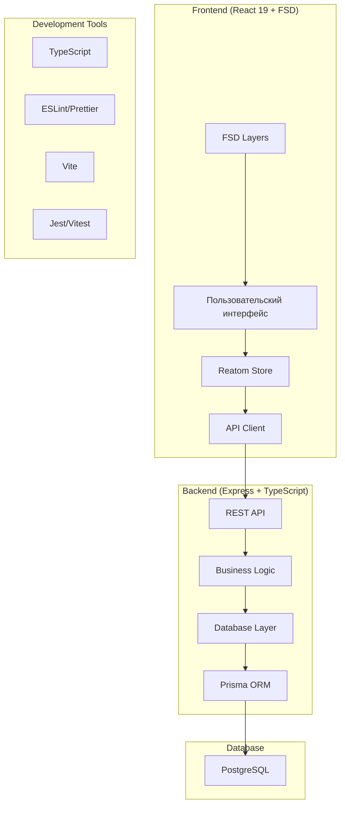

# Архитектура проекта "Календарь звонков"

## Обзор проекта
Проект представляет собой систему бронирования звонков в календаре с API спецификацией на TypeSpec. Требуется реализовать бэкенд и фронтенд согласно спецификации.

## Архитектурные решения

### Монолитная архитектура (Monorepo)
Выбрана монолитная архитектура с разделением на бэкенд и фронтенд в одном репозитории:
- **Преимущества**: простота разработки, общие зависимости, единый CI/CD
- **Структура**: раздельные директории для бэкенда и фронтенда

### Технологический стек

#### Бэкенд
- **Язык**: TypeScript (строго)
- **Фреймворк**: Express.js
- **База данных**: PostgreSQL + Prisma ORM
- **Валидация**: Zod
- **Аутентификация**: JWT (если потребуется в будущем)
- **Документация**: OpenAPI (генерируется из TypeSpec)
- **Тестирование**: Jest + Supertest

#### Фронтенд
- **Язык**: TypeScript (строго)
- **Фреймворк**: React 19
- **Архитектура**: Feature-Sliced Design (FSD)
- **Управление состоянием**: Reatom v1000
- **Стилизация**: Tailwind CSS
- **Сборка**: Vite
- **Тестирование**: Vitest + React Testing Library

## Структура директорий

### Корневая структура проекта
```
ai-for-developers-project-386/
├── backend/                 # Бэкенд приложение
├── frontend/               # Фронтенд приложение
├── shared/                 # Общий код (типы, утилиты)
├── docs/                   # Документация
├── scripts/                # Вспомогательные скрипты
├── docker/                 # Docker конфигурации
├── .github/               # GitHub Actions
├── main.tsp               # Существующая спецификация TypeSpec
├── package.json           # Корневой package.json (workspace)
└── README.md
```

### Детальная структура бэкенда
```
backend/
├── src/
│   ├── config/            # Конфигурация приложения
│   ├── database/          # Настройка БД, миграции Prisma
│   ├── entities/          # Сущности домена (Owner, EventType, Slot, Booking)
│   │   ├── owner/
│   │   │   ├── owner.model.ts
│   │   │   ├── owner.service.ts
│   │   │   ├── owner.controller.ts
│   │   │   └── owner.router.ts
│   │   ├── event-type/
│   │   ├── slot/
│   │   └── booking/
│   ├── middleware/        # Промежуточное ПО (валидация, ошибки)
│   ├── utils/             # Утилиты и хелперы
│   ├── types/             # TypeScript типы
│   ├── app.ts             # Инициализация Express приложения
│   └── server.ts          # Запуск сервера
├── tests/
│   ├── unit/              # Юнит-тесты
│   ├── integration/       # Интеграционные тесты
│   └── fixtures/          # Тестовые данные
├── prisma/
│   ├── schema.prisma      # Схема БД Prisma
│   └── migrations/        # Миграции БД
├── dist/                  # Скомпилированный код
├── package.json
├── tsconfig.json
├── .env.example
└── Dockerfile
```

### Детальная структура фронтенда (FSD)
```
frontend/
├── src/
│   ├── app/               # Инициализация приложения
│   │   ├── providers/     # Провайдеры (React Query, Reatom, Router)
│   │   ├── styles/        # Глобальные стили
│   │   ├── router/        # Конфигурация маршрутизации
│   │   └── main.tsx       # Точка входа
│   ├── pages/             # Страницы приложения
│   │   ├── home/          # Главная страница
│   │   ├── event-types/   # Страница типов событий
│   │   ├── calendar/      # Календарь для бронирования
│   │   ├── bookings/      # Страница бронирований
│   │   └── not-found/     # 404 страница
│   ├── widgets/           # Самостоятельные виджеты
│   │   ├── header/        # Шапка приложения
│   │   ├── sidebar/       # Боковая панель
│   │   ├── calendar-view/ # Виджет календаря
│   │   └── booking-form/  # Форма бронирования
│   ├── features/          # Бизнес-логика
│   │   ├── event-types/   # Управление типами событий
│   │   │   ├── api/       # API вызовы
│   │   │   ├── model/     # Модель Reatom
│   │   │   ├── ui/        # Компоненты фичи
│   │   │   └── lib/       # Вспомогательная логика
│   │   ├── slots/         # Управление слотами
│   │   ├── bookings/      # Управление бронированиями
│   │   └── auth/          # Аутентификация (если понадобится)
│   ├── entities/          # Бизнес-сущности
│   │   ├── owner/         # Сущность владельца
│   │   ├── event-type/    # Сущность типа события
│   │   ├── slot/          # Сущность слота
│   │   └── booking/       # Сущность бронирования
│   ├── shared/            # Переиспользуемый код
│   │   ├── api/           # Настройка API клиента
│   │   ├── ui/            # Базовые UI компоненты
│   │   ├── lib/           # Утилиты и хелперы
│   │   └── config/        # Конфигурация
│   └── index.html         # HTML шаблон
├── public/                # Статические файлы
├── tests/                 # Тесты
├── package.json
├── vite.config.ts
├── tsconfig.json
├── tailwind.config.js
└── Dockerfile
```

## Конфигурационные файлы

### Корневой package.json (workspace)
```json
{
  "name": "calendar-booking-app",
  "version": "1.0.0",
  "private": true,
  "workspaces": ["backend", "frontend", "shared"],
  "scripts": {
    "dev": "concurrently \"npm run dev:backend\" \"npm run dev:frontend\"",
    "dev:backend": "npm run dev --workspace=backend",
    "dev:frontend": "npm run dev --workspace=frontend",
    "build": "npm run build --workspaces",
    "test": "npm run test --workspaces",
    "lint": "npm run lint --workspaces",
    "format": "npm run format --workspaces"
  },
  "devDependencies": {
    "concurrently": "^8.0.0"
  }
}
```

### Общие зависимости
- **TypeScript**: ^6.0.0
- **ESLint**: ^10.0.0
- **Prettier**: ^3.8.0
- **Husky**: ^8.0.0 (для pre-commit хуков)

## План реализации

### Фаза 1: Настройка проекта
1. Создать структуру директорий
2. Настроить корневой package.json с workspaces
3. Инициализировать бэкенд и фронтенд как отдельные пакеты
4. Настроить общие конфигурации (TypeScript, ESLint, Prettier)

### Фаза 2: Разработка бэкенда
1. Настроить Express с TypeScript
2. Подключить Prisma и настроить БД
3. Реализовать сущности согласно TypeSpec спецификации
4. Создать REST API endpoints
5. Настроить валидацию и обработку ошибок
6. Написать тесты

### Фаза 3: Разработка фронтенда
1. Настроить Vite с React 19 и TypeScript
2. Настроить Reatom для управления состоянием
3. Реализовать FSD структуру
4. Создать базовые компоненты и страницы
5. Подключить API клиент к бэкенду
6. Реализовать основные фичи (просмотр типов событий, календарь, бронирование)

### Фаза 4: Интеграция и тестирование
1. Настроить взаимодействие фронтенда и бэкенда
2. Реализовать end-to-end тесты
3. Настроить CI/CD пайплайн
4. Документировать API

## Диаграмма архитектуры



## Рекомендации по разработке

### Для бэкенда
1. Следуйте TypeSpec спецификации как источнику истины
2. Используйте Prisma для type-safe доступа к БД
3. Реализуйте валидацию входных данных с Zod
4. Настройте централизованную обработку ошибок
5. Пишите unit и integration тесты

### Для фронтенда
1. Строго следуйте FSD архитектуре
2. Используйте Reatom для глобального состояния
3. Разделяйте бизнес-логику и UI компоненты
4. Используйте TypeScript для type-safe API вызовов
5. Реализуйте responsive дизайн с Tailwind CSS

### Общие рекомендации
1. Используйте единый code style
2. Настройте pre-commit хуки для линтинга и тестов
3. Документируйте сложную бизнес-логику
4. Следите за производительностью приложения

## Следующие шаги
1. Утвердить архитектуру
2. Переключиться в режим Code для реализации
3. Начать с Фазы 1: Настройка проекта